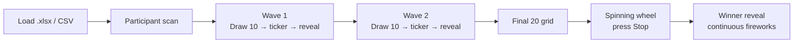

# NVIDIA DGX Spark Lucky Draw

A stage-ready finalist selection web app for live events. Narrows ~700 participants to a single winner through a scripted multi-stage show: **700 → Wave 1 (10) → Wave 2 (10) → Final 20 → Spinning Wheel → Winner**.

Built with **React 19 · TypeScript · Vite · Framer Motion · canvas-confetti**.


> Replace the hero image above and the screenshots below with captures from your own run — see [Screenshots](#screenshots).

## Show flow



Each stage has its own animation and operator trigger. Space advances the primary action; R replays; F toggles fullscreen; M toggles sound.

## What makes it different

- **Click-time randomness.** The picks are **not precomputed**. Every time you press **Draw 10**, a fresh seed is generated (`Date.now()` + `crypto.getRandomValues`) and 10 finalists are sampled *at that moment*. Wave 2 samples from the remaining pool. The winner is decided at the exact moment you press **Stop** on the wheel — the wheel's final angle is the source of truth, no post-hoc correction.
- **Spinning wheel, not marbles.** 20 equal slices with a **repeating NVIDIA green / black / off-white** palette. Each slice shows a candidate's name. Auto-spins at 240 °/s; Stop triggers a **22-second, power-4 ease-out deceleration** with simultaneous zoom-in toward the pointer. The final slice crosses the pointer over several seconds for maximum tension.
- **Dramatic waves.** Before a wave reveals, a 4-second ticker shuffles through the full participant pool in three parallax rows (name · affiliation · email scrolling left at different speeds). Then the 10 finalists pop in sequentially with spring physics.
- **Winner fireworks.** `canvas-confetti` fires three synchronized bursts (left-low, right-low, center-high) every 1.1 s continuously while the winner card is on screen.
- **Audit trail.** Every draw exports a JSON log with participant count, fingerprint hash, all picked IDs, per-wave seeds, and winner ID. Reproducible in case of a dispute.

## Screenshots

Drop captures into `docs/` and reference them below.

| Stage | Preview |
| --- | --- |
| Idle · data load | `docs/01-idle.png` |
| Participant scan | `docs/02-scan.png` |
| Wave 1 — ticker (standby) | `docs/03-wave-standby.png` |
| Wave 1 — drawing (shuffle) | `docs/04-wave-drawing.png` |
| Wave reveal (10 cards) | `docs/05-wave-reveal.png` |
| Final 20 (5×4 grid) | `docs/06-final20.png` |
| Spinning wheel | `docs/07-wheel.png` |
| Winner + fireworks | `docs/08-winner.png` |

## Input format

Accepts `.xlsx`, `.csv`, Google Sheets CSV export, or pasted CSV / JSON via the textarea.

- If the `.xlsx` contains a sheet named **`정리`**, that sheet is used (fallback: first sheet).
- Header matching is **token-based** — the parser tokenizes each header on Unicode letter/digit boundaries and checks against alias sets, so composite headers like `"1. 이름 / Name\n\n예시) 홍길동 / Gildong Hong"` still map correctly.

| Field | Required | Accepted tokens (case/spacing-insensitive) |
| --- | --- | --- |
| `name` | **yes** | 이름, 성명, 참가자, name, fullname, participant, candidate |
| `affiliation` | optional | 학과, 전공, major, department, 단과대학, college, school, 소속, … |
| `email` | optional | 이메일, email, mail |
| `phone` | optional | 휴대폰, 연락처, 전화, mobile, phone |

Unknown columns are preserved in `metadata` on each participant record. Duplicates are removed by **email** if present, otherwise by normalized **name + affiliation**.

## Run

```bash
npm install
npm run dev        # http://localhost:5173
npm run build      # tsc -b + vite build
npm run preview    # serve the production build
```

Requires Node ≥ 18.

## Project layout

```
src/
  app/
    App.tsx              # top-level state machine
    stages.ts            # STAGE_ORDER + labels
  components/
    common/
      OperatorPanel.tsx  # centered primary CTA + bottom-right action strip
    stage/
      IdleStage.tsx
      ParticipantScanStage.tsx
      WaveRevealStage.tsx  # idle (ticker) → drawing (shuffle) → reveal
      FinalGridStage.tsx
      WinnerRevealStage.tsx
    roulette/
      RouletteStage.tsx  # SVG spinning wheel, RAF-driven, live winner
  features/
    input/parser.ts      # xlsx / csv / json parsing + dedupe
    selection/selection.ts  # initSelection, drawWave, clearWave
  lib/
    random/seededRandom.ts  # mulberry32 + crypto seed helper
    logger/drawLog.ts       # JSON audit log
    audio/cues.ts           # optional stage SFX
  styles.css
```

## Operator controls

- **Center CTA (80 vh)** — contextual primary action:
  - `idle` → hidden (awaiting data)
  - `data_loaded` → **Start show**
  - `scan` / `final20` → **Next stage**
  - `wave1` / `wave2` before click → **Draw 10**
  - `wave1` / `wave2` after reveal → **Next stage**
  - `roulette` → **Stop** (rendered by the wheel itself)
  - `winner` → **Restart show**
- **Bottom-right strip** — Back · Replay · Restart · Sound · Fullscreen · Export log.
- **Replay** on a wave stage clears that wave's picks so the next Draw 10 re-samples fresh.

## Privacy

Spreadsheets are never uploaded anywhere — parsing happens entirely in the browser. `.xlsx`, `.xls`, and `.csv` are gitignored by default. Stage UI shows `name`, `affiliation`, and `email` (email added because duplicate names are common in this dataset); `phone` and any extra columns stay in `metadata` and are never rendered.

## Credits

- Show spec and creative direction: [`claude.md`](claude.md).
- Roulette concept originally inspired by [lazygyu/roulette](https://github.com/lazygyu/roulette) (MIT). The final implementation is a custom SVG wheel — the original Box2D marble engine files remain in `src/components/roulette/original/` for reference but are not imported by the app.
